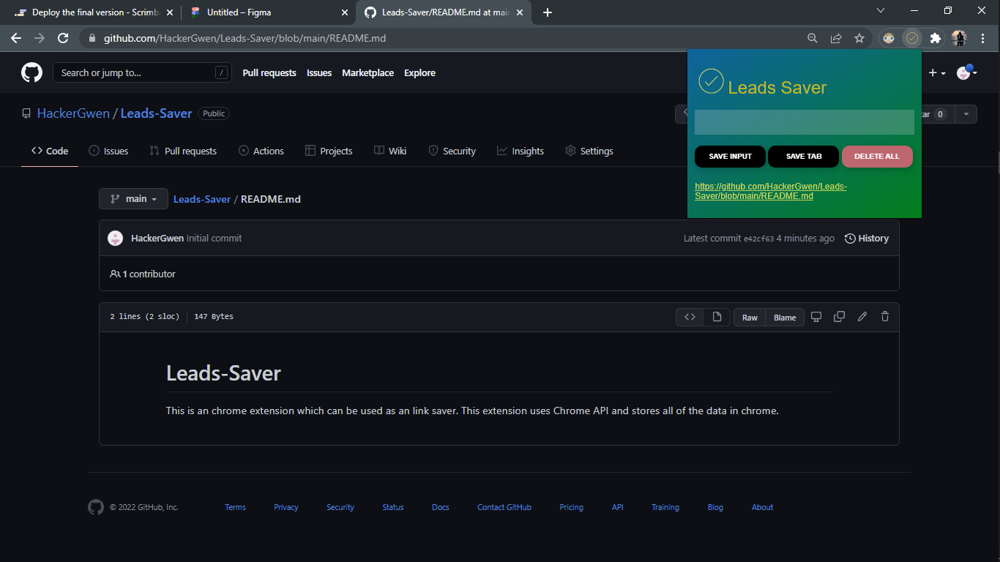
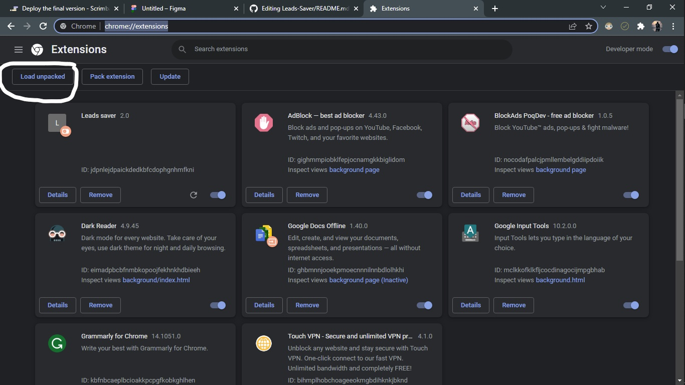

# Leads-Saver
This is an chrome extension which can be used as an link or leads saver. This extension uses Chrome API and stores all of the data in localstorage.As This extension is built with Chrome API it only works on Chrome. But you can test it on Github Pages as well.

<a href="https://www.figma.com/file/r2q935XMf7Ur2ybVyH0LVk/Leads-Saver-Extension?t=iWMb3RijLqr8Lq52-1">Figma Design</a>
 

To use this extension you can follow the following steps:
<ol><li>Download zip folder and extract it to a specific folder.</li>
  <li>Open your chrome and type chrome://extensions/</li>
  
  <li>Click on Load Unpacked and choose the code folder.</li>
  <li>Now your extension is ready to use you can pin it on extension bar</li>
